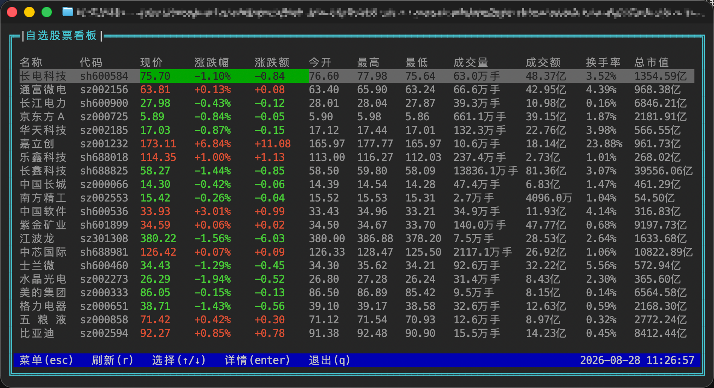
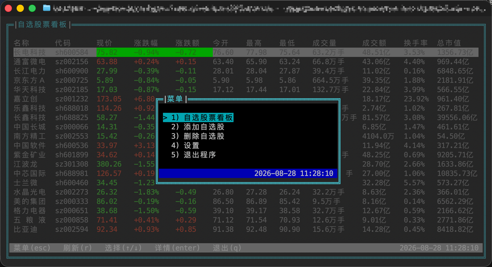
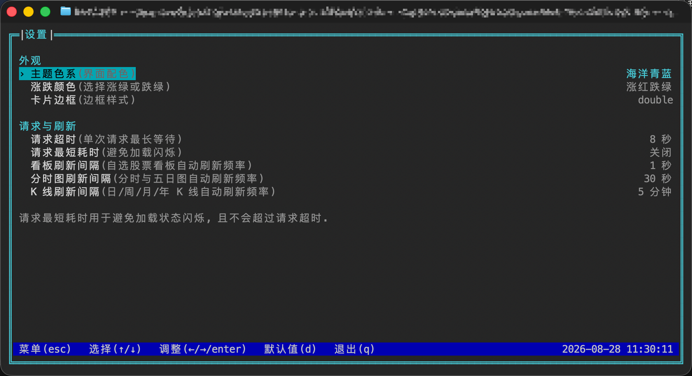
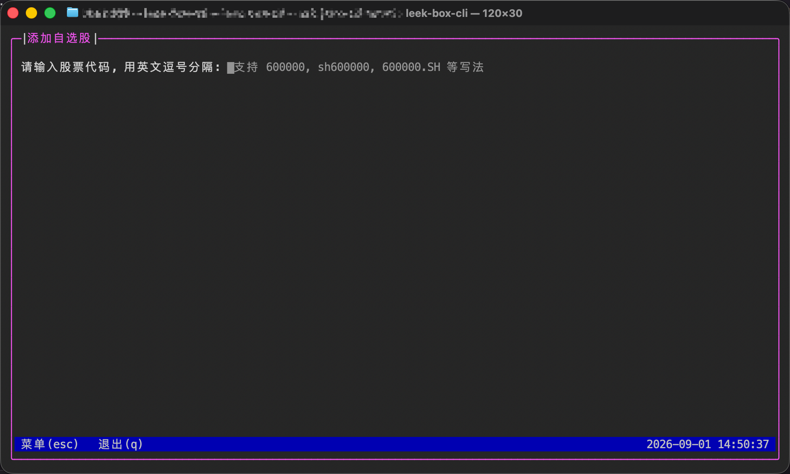
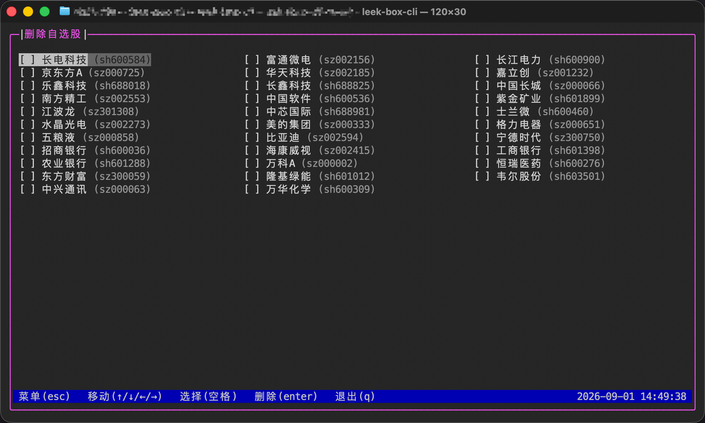
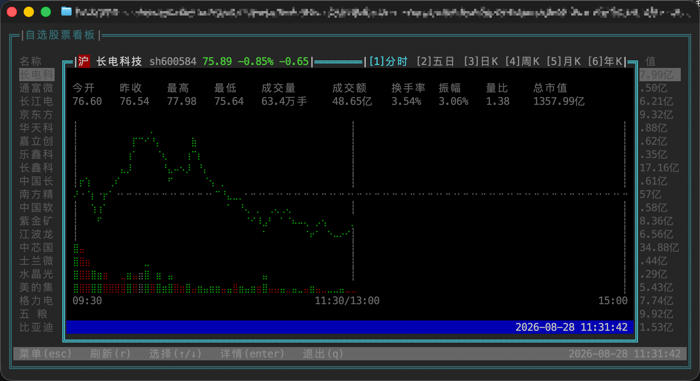
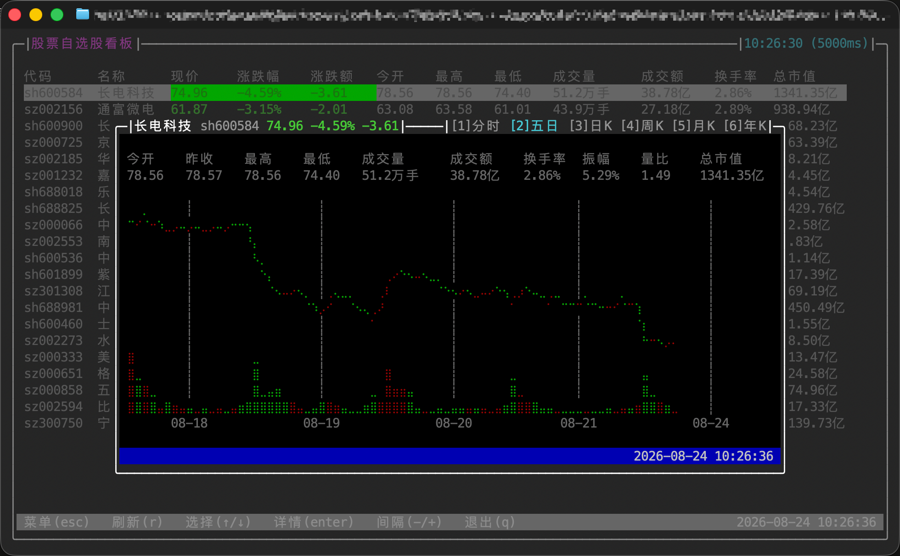
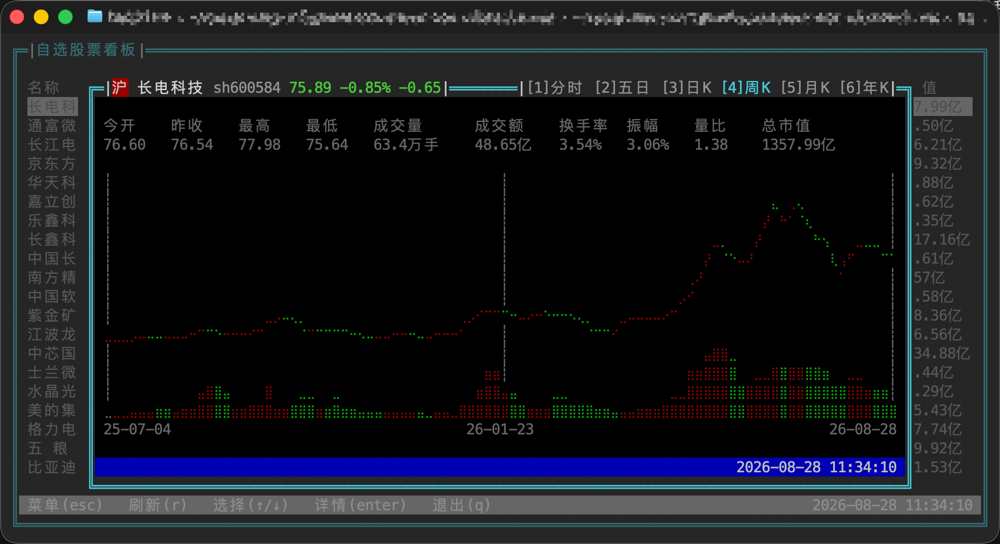
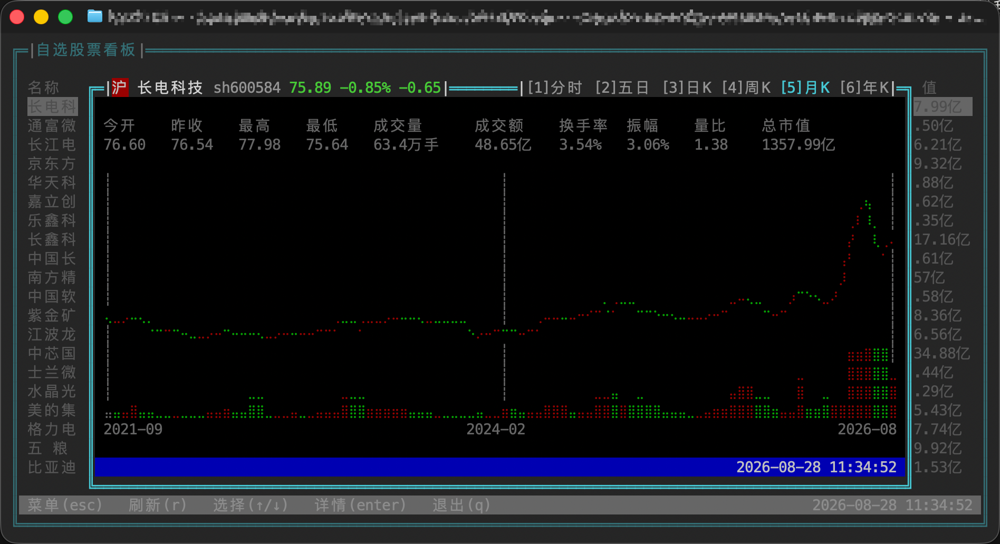

<p align="right">
  <strong>中文</strong> | <a href="README-en.md">English</a>
</p>

# leek-box-cli(韭菜盒子)

> 基于 [Ink](https://github.com/vadimdemedes/ink) 的交互式终端自选股票看板.

## 截图

### 自选股票看板

<p align="center">
  
</p>

### 菜单与设置

<table>
  <tr>
    <td align="center" width="50%"><strong>菜单</strong></td>
    <td align="center" width="50%"><strong>设置</strong></td>
  </tr>
  <tr>
    <td></td>
    <td></td>
  </tr>
</table>

### 自选股管理

<table>
  <tr>
    <td align="center" width="50%"><strong>添加自选股</strong></td>
    <td align="center" width="50%"><strong>删除自选股</strong></td>
  </tr>
  <tr>
    <td></td>
    <td></td>
  </tr>
</table>

### 股票详情

<table>
  <tr>
    <td align="center" width="50%"><strong>分时</strong></td>
    <td align="center" width="50%"><strong>五日</strong></td>
  </tr>
  <tr>
    <td></td>
    <td></td>
  </tr>
  <tr>
    <td align="center" width="50%"><strong>日 K</strong></td>
    <td align="center" width="50%"><strong>周 K</strong></td>
  </tr>
  <tr>
    <td></td>
    <td></td>
  </tr>
  <tr>
    <td align="center" width="50%"><strong>月 K</strong></td>
    <td align="center" width="50%"><strong>年 K</strong></td>
  </tr>
  <tr>
    <td></td>
    <td></td>
  </tr>
</table>

## 功能

- **实时看板**: 启动即展示自选股的现价, 涨跌幅, 涨跌额, 今开, 最高, 最低, 成交量, 成交额, 换手率和总市值; 默认每 5 秒刷新.
- **行选择与详情**: `↑`/`↓` 选择股票, `enter` 打开基础行情和趋势图; 数字键 `1`-`6` 切换分时, 五日, 日 K, 周 K, 月 K 和年 K.
- **多周期行情**: 分时与五日分钟走势每 30 秒刷新; 日 K, 周 K, 月 K 和年 K 每 5 分钟刷新.
- **刷新控制**: `r` 立即刷新; 在设置页以 500 ms 步进调整自动刷新间隔, 范围为 1-60 秒.
- **自选股管理**: 支持添加, 删除沪深北 A 股与 ETF; 股票代码可写为 `600000`, `sh600000`, `600000.SH` 等形式.
- **容错展示**: 停牌, 部分行情缺失和刷新失败均有独立状态; 后续轮询成功后自动恢复.

## 交互方式

- `esc`: 打开菜单; 详情已打开时优先关闭详情, 菜单已打开时关闭菜单.
- 菜单内使用 `↑`/`↓`, `enter` 或数字键选择页面.
- 看板内使用 `↑`/`↓`, `enter`, `r`.
- 设置页使用 `↑`/`↓` 选择配置, 使用 `←`/`→` 或 `enter` 调整.
- 股票详情内使用 `1`-`6` 切换 `分时`, `五日`, `日 K`, `周 K`, `月 K`, `年 K`.
- `q`: 没有菜单或详情浮层时退出; 浮层打开时不退出, 避免误触.
- 状态栏右侧显示 Asia/Shanghai 时区的 `YYYY-MM-DD HH:MM:SS`.

## 环境要求

- [Node.js](https://nodejs.org/) >= 22.19.0 (或 >= 24)
- [pnpm](https://pnpm.io/) >= 11.0.0

行情通过 Node.js 原生 `fetch` 获取, 无 curl 等外部运行工具依赖.

## 行情数据源

- 实时行情: 腾讯行情接口 `https://qt.gtimg.cn/q=...`, GBK 编码, 无需鉴权.
- 当日分时: 腾讯分时接口 `https://web.ifzq.gtimg.cn/appstock/app/minute/query?code=...`.
- 五日分时: 腾讯多日分时接口 `https://web.ifzq.gtimg.cn/appstock/app/day/query?code=...`.
- 日 K, 周 K, 月 K: 腾讯前复权 K 线接口 `https://web.ifzq.gtimg.cn/appstock/app/fqkline/get?param=...`.
- 年 K: 使用同一接口的后复权月 K, 在本地按年份聚合.
- 数据实时性和可用性以接口实际返回为准, 仅用于个人展示用途.

## 安装与运行

### 全局安装 (推荐)

```bash
npm install -g leek-box-cli
# 或
pnpm add -g leek-box-cli
# 或
yarn global add leek-box-cli
```

之后即可在任意目录运行:

```bash
leek-box-cli
```

> 运行命令的机器需要 Node.js 22.19+ (或 24+).

也可以免安装直接运行一次:

```bash
npx leek-box-cli
# 或
pnpm dlx leek-box-cli
```

### 从源码运行

```bash
pnpm install

# 开发模式
pnpm dev

# 构建并运行
pnpm build
pnpm preview
```

也可以通过子命令指定初始页面:

```bash
leek-box-cli               # 自选股票看板
leek-box-cli stock-list    # 同上
leek-box-cli stock-add     # 添加自选股
leek-box-cli stock-remove  # 删除自选股
leek-box-cli -v            # 查看版本
leek-box-cli -h            # 查看帮助
```

## 设置与自选股存储

设置与自选股一起保存在 `$XDG_CONFIG_HOME/leek-box-cli/settings.json`; 未设置 `XDG_CONFIG_HOME` 时, Linux 和 macOS 使用 `~/.config/leek-box-cli/settings.json`, Windows 使用 `%APPDATA%\leek-box-cli\settings.json`.

Windows 兼容说明: 读取配置时会自动去除记事本等编辑器写入的 UTF-8 BOM, 因此手动编辑 settings.json 后不会因 BOM 导致解析失败.

文件结构为:

```json
{
  "theme": {
    "preset": "classic",
    "trendColorMode": "red-up",
    "borderStyle": "round"
  },
  "request": {
    "timeoutMs": 8000,
    "minimumDurationMs": 0,
    "quotePollIntervalMs": 5000,
    "minuteChartPollIntervalMs": 30000,
    "klinePollIntervalMs": 300000
  },
  "stocks": [
    {
      "code": "sh600000",
      "name": "浦发银行",
      "addedAt": "2026-08-20T00:00:00.000Z"
    }
  ]
}
```

程序每次刷新看板都会重新读取文件, 因此合法的外部编辑会在下一轮刷新生效. 读取时会校验 `theme`, `request` 以及每只股票的 `code`, `name`, `addedAt` 和重复代码; 写入使用进程间锁与临时文件原子替换, 避免并发读改写丢失和半截 JSON.

## 开发脚本

| 命令              | 说明                          |
| ----------------- | ----------------------------- |
| `pnpm dev`        | 使用 tsx 运行源码             |
| `pnpm build`      | 使用 Vite 构建 `dist/cli.mjs` |
| `pnpm preview`    | 运行构建产物                  |
| `pnpm test`       | 使用 Vitest 运行测试          |
| `pnpm typecheck`  | TypeScript 类型检查           |
| `pnpm lint`       | Lint 并自动修复               |
| `pnpm lint:check` | 仅检查 Lint                   |
| `pnpm fmt`        | 格式化代码                    |
| `pnpm fmt:check`  | 检查格式                      |

## 技术栈

- TypeScript / ESM
- Ink 7 + React 19
- Zustand 5
- meow
- Vite
- oxlint / oxfmt
- Vitest
