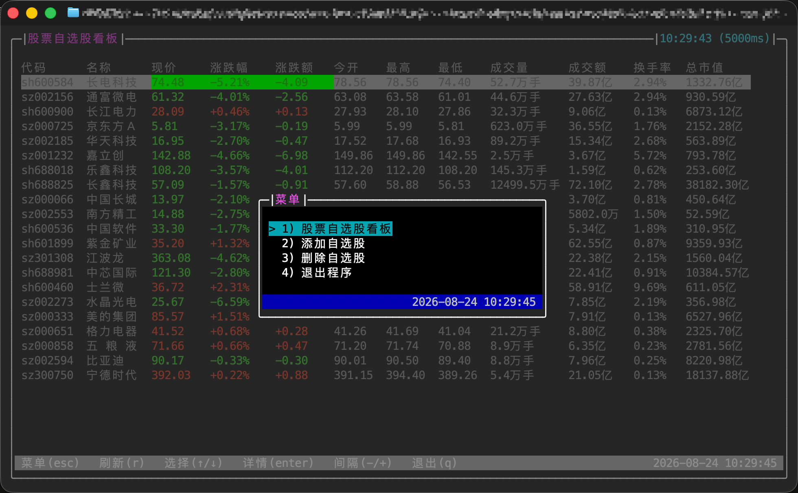
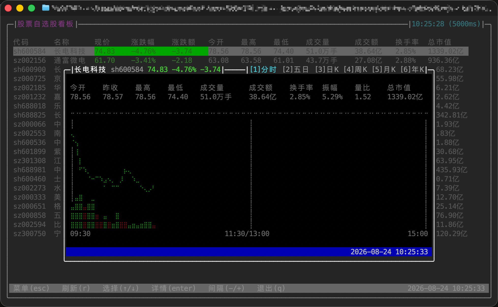
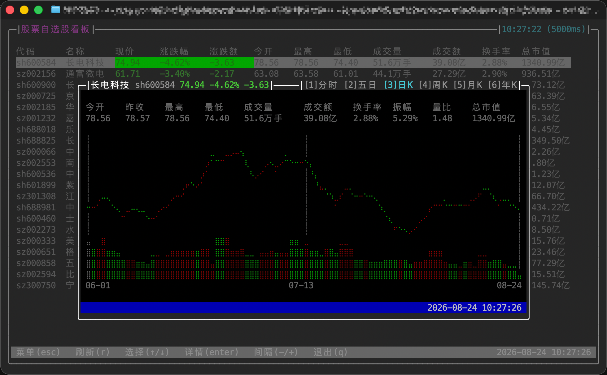
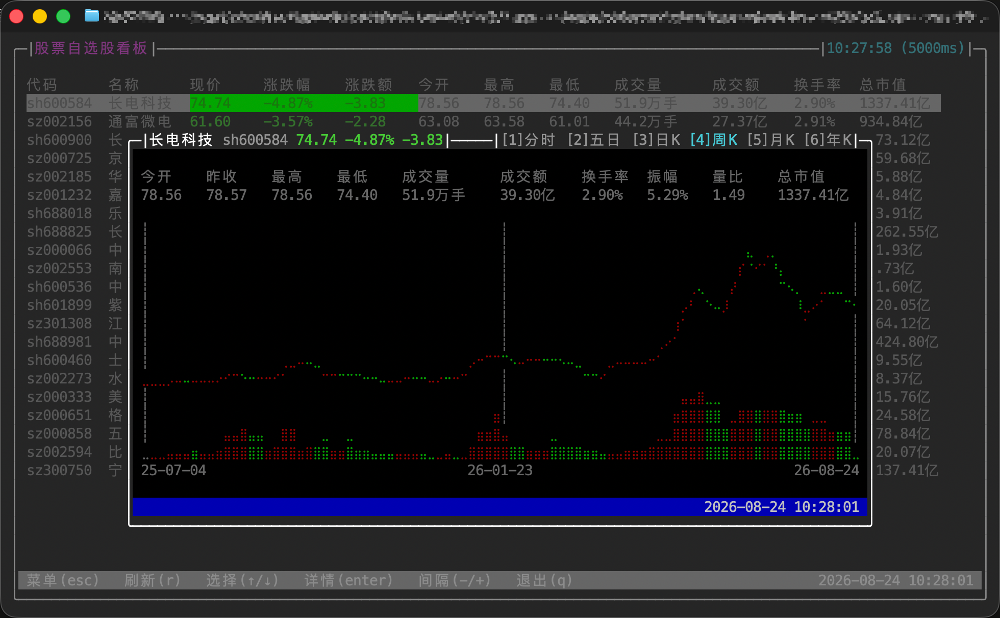
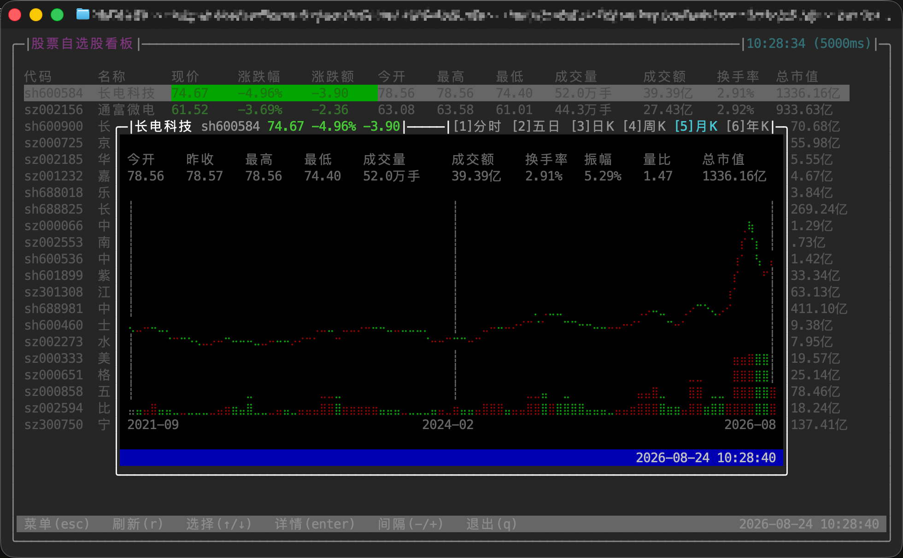
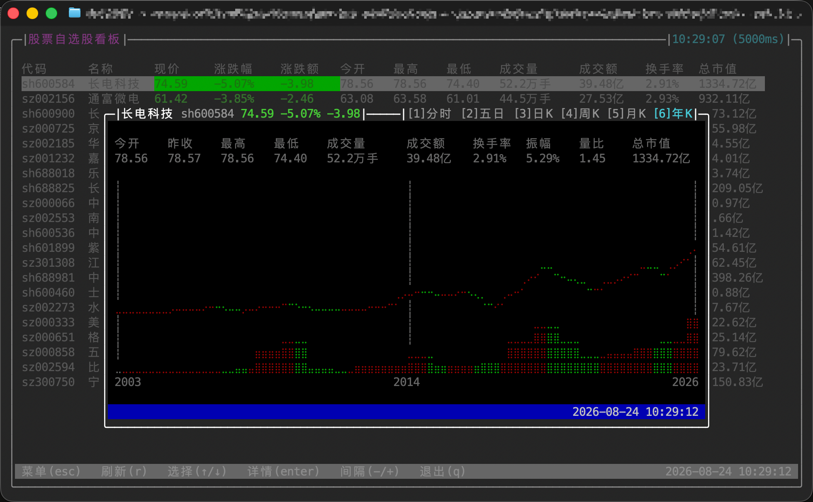

<p align="right">
  <strong>English</strong> | <a href="README-zh.md">中文</a>
</p>

# leek-box-cli

> An interactive terminal stock watchlist dashboard built with [Ink](https://github.com/vadimdemedes/ink).

## Screenshots

### Stock Watchlist


### Menu



### Stock Details

<table>
  <tr>
    <td align="center"><strong>Intraday</strong></td>
    <td align="center"><strong>Five-day</strong></td>
  </tr>
  <tr>
    <td></td>
    <td></td>
  </tr>
  <tr>
    <td align="center"><strong>Daily</strong></td>
    <td align="center"><strong>Weekly</strong></td>
  </tr>
  <tr>
    <td></td>
    <td></td>
  </tr>
  <tr>
    <td align="center"><strong>Monthly</strong></td>
    <td align="center"><strong>Yearly</strong></td>
  </tr>
  <tr>
    <td></td>
    <td></td>
  </tr>
</table>

## Features

- **Real-time dashboard**: Displays the latest price, percentage change, price change, open, high, low, volume, turnover, turnover rate, and total market capitalization for every stock in your watchlist. Refreshes every 5 seconds by default.
- **Row selection and details**: Use `↑`/`↓` to select a stock and `enter` to open its quote details and trend chart. Press `1`-`6` to switch between intraday, five-day, daily, weekly, monthly, and yearly views.
- **Multiple time frames**: Intraday and five-day minute charts refresh every 30 seconds. Daily, weekly, monthly, and yearly charts refresh every 5 minutes.
- **Refresh controls**: Press `r` to refresh immediately. Use `-`/`+` to adjust the automatic refresh interval in 500 ms increments, from 1 to 60 seconds.
- **Watchlist management**: Add or remove Shanghai, Shenzhen, and Beijing A-shares and ETFs. Stock codes can be entered as `600000`, `sh600000`, `600000.SH`, and other common formats.
- **Resilient display**: Suspended stocks, incomplete quotes, and refresh failures each have a dedicated state. The display recovers automatically after a later poll succeeds.

## Controls

- `esc`: Open the menu. If stock details are open, close them first; if the menu is open, close it.
- In the menu, use `↑`/`↓`, `enter`, or a number key to select a page.
- In the dashboard, use `↑`/`↓`, `enter`, `r`, `-`, and `+`.
- In stock details, press `1`-`6` to switch between `Intraday`, `Five-day`, `Daily`, `Weekly`, `Monthly`, and `Yearly`.
- `q`: Exit when no menu or stock details overlay is open. It does nothing while an overlay is open to prevent accidental exits.
- The right side of the status bar displays `YYYY-MM-DD HH:MM:SS` in the Asia/Shanghai time zone.

## Requirements

- [Node.js](https://nodejs.org/) >= 26.7.0
- [pnpm](https://pnpm.io/) >= 10.0.0

Market data is retrieved with the native Node.js `fetch` API, with no external runtime dependency such as curl.

## Market Data Sources

- Real-time quotes: Tencent quote API at `https://qt.gtimg.cn/q=...`; GBK-encoded and requires no authentication.
- Intraday data: Tencent minute API at `https://web.ifzq.gtimg.cn/appstock/app/minute/query?code=...`.
- Five-day data: Tencent multi-day minute API at `https://web.ifzq.gtimg.cn/appstock/app/day/query?code=...`.
- Daily, weekly, and monthly data: Tencent forward-adjusted K-line API at `https://web.ifzq.gtimg.cn/appstock/app/fqkline/get?param=...`.
- Yearly data: Aggregated locally by year from backward-adjusted monthly data returned by the same API.
- Data timeliness and availability depend on the upstream APIs. This project is intended for personal display purposes only.

## Installation and Usage

```bash
pnpm install

# Development mode
pnpm dev

# Build and run
pnpm build
pnpm preview

# Build a standalone Node.js SEA executable
pnpm bundle
./dist/leek-box-cli
```

You can also select the initial page with a subcommand:

```bash
leek-box-cli               # Stock watchlist dashboard
leek-box-cli stock-list    # Same as above
leek-box-cli add-stock     # Add a stock to the watchlist
leek-box-cli remove-stock  # Remove a stock from the watchlist
leek-box-cli -v            # Show version information
leek-box-cli -h            # Show help
```

## Watchlist Storage

The watchlist is stored at `$XDG_CONFIG_HOME/leek-box-cli/watchlist.json`. If `XDG_CONFIG_HOME` is not set, `~/.config/leek-box-cli/watchlist.json` is used.

File structure:

```json
[
  {
    "code": "sh600000",
    "name": "浦发银行",
    "addedAt": "2026-08-20T00:00:00.000Z"
  }
]
```

The application reloads the file every time it refreshes the dashboard, so valid external edits take effect on the next refresh. It validates `code`, `name`, `addedAt`, and duplicate codes when reading. Writes use an inter-process lock and atomic temporary-file replacement to prevent lost concurrent updates and partial JSON files.

## Development Scripts

| Command           | Description                                      |
| ----------------- | ------------------------------------------------ |
| `pnpm dev`        | Run the source code with tsx                     |
| `pnpm build`      | Build `dist/cli.mjs` with Vite                   |
| `pnpm preview`    | Run the build output                             |
| `pnpm test`       | Run tests with the Node.js test runner           |
| `pnpm typecheck`  | Run TypeScript type checking                     |
| `pnpm lint`       | Run the linter and apply automatic fixes         |
| `pnpm lint:check` | Run the linter without modifying files           |
| `pnpm fmt`        | Format the code                                  |
| `pnpm fmt:check`  | Check code formatting                            |
| `pnpm bundle`     | Build and package a standalone Node.js SEA file  |
| `pnpm sea`        | Package SEA only; requires existing build output |

## Tech Stack

- TypeScript / ESM
- Ink 7 + React 19
- Zustand 5
- meow
- Vite
- oxlint / oxfmt
- Node.js test runner + tsx
